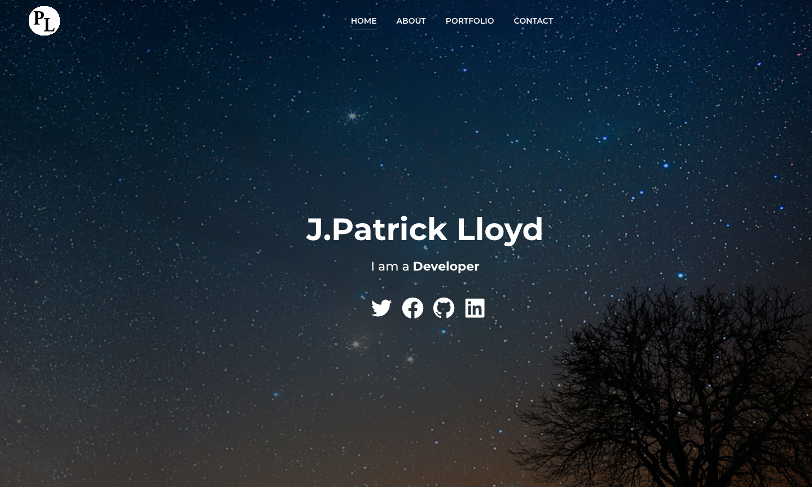

## J.Patrick Lloyd Portfolio

## Description 
An updated portfolio page using React with sample projects and resume info.
* About section with short bio.
* Skill list and Resume.
* Portfolio with deployed projects.
* Links to personal pages
  * Twitter
  * Facebook
  * GitHub
  * Linkedin
## Screenshots

## Table of contents
- [Description](#Description)
- [License](#License)
- [Repository Link](#Repository)
- [Diployed App Info](#App) 
- [GitHub Info](#GitHub) 
## License
MIT
## Repository
- [Portfolio](https://github.com/Meddle74/jpatricklloyd)

## App
[Patrick Lloyd Portfolio](https://jolly-murdock-9b5a71.netlify.app/)
## GitHub
- Email: jpatricklloyd@gmail.com
- [GitHub Profile](https://github.com/Meddle74)